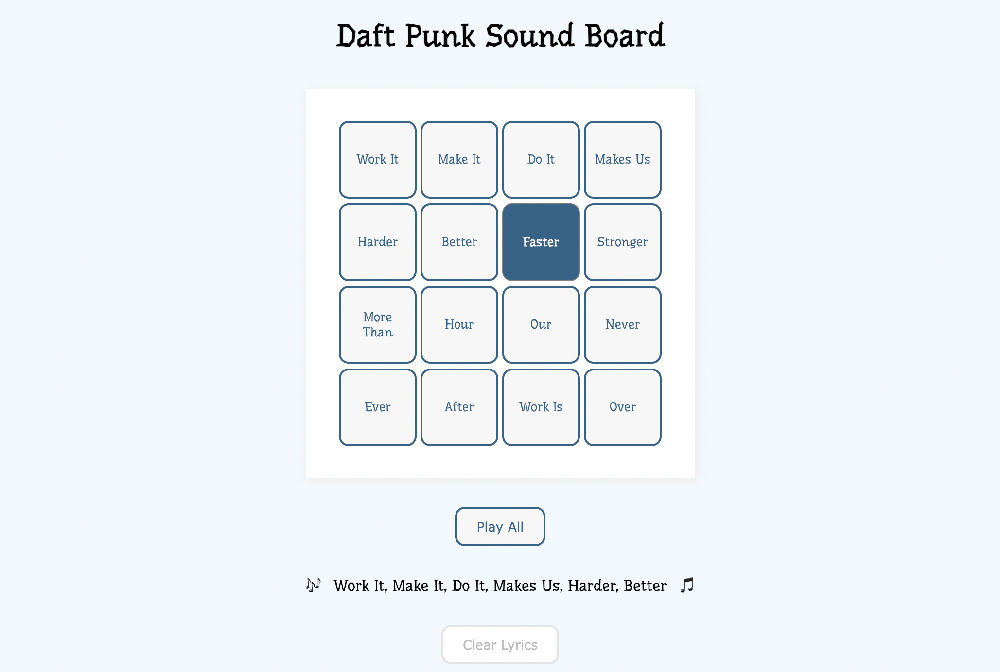

# Sound Board

  

A mini project experimenting with audio files, event listeners and object manipulation in HTML, CSS and vanilla JS. Completed as part of a GA Lab, Feb 2022.

## Installation
1. Clone this repo
2. Run `live-server` in the project's root directory.